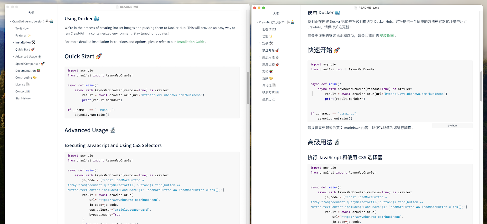

# quickdoc


***

## 一、关于 quickdoc

quickdoc 是一款文档批量下载、处理工具，旨在让 开发人员 更快速方便 获取文档、翻译、阅读。


***

### 功能说明

主要包含以下功能

1. 下载文档：根据文档导航栏 xpath 获取子文档链接，爬取。
2. 保存为 `.md` 文件，使用 html 转 markdown；
3. 爬取 repo 详细信息，及 readme 文件下载 
4. 下载微信公众号文章，并转为 markdown 格式；
5. markdown 拆分解析，参考 [mdsplit](https://github.com/alandefreitas/mdsplit)。
由于本项目目标是实现 翻译、整理文档，目前没有处理markdown 内容深度关系。
6. 调用大模型翻译 markdown（代码、图片链接等自动不翻译）。
这里我使用 [LiteLLM](https://github.com/BerriAI/litellm) + openai 兼容接口 调用大模型接口。教程可参考：<https://ezcode.blog.csdn.net/article/details/142249313>。

***
### 我的自动翻译效果



***

## 二、安装准备

1、下载本项目

目前项目还没上传到 PYPI，不能使用 pip 下载安装

```shell
git clone https://github.com/ezscode/quickdoc.git
```

***

2、安装依赖

```shell
cd quickdoc
pip install -r requirements.txt
```

***

## 三、使用示例

详见 `examles.py` 

***

### 1、下载 github readme


```python
from quickdoc import QuickDoc 

def test_gh():

    qd = QuickDoc()  
    qd.repo_name = 'python-pillow/Pillow'  
    qd.setup()  
    qd.get_github_readme()   

```


***

### 2、下载文档

```python
from quickdoc import QuickDoc 


# 测试下载文档
def test_doc():

    qd = QuickDoc()
    qd.domain_name = 'llamaindex' 
    qd.doc_urls = ['https://docs.llamaindex.ai/en/stable/']
    qd.doc_xpath_list = '//nav[@data-md-level="1"]/ul/li[@class="md-nav__item"]'
    qd.doc_xpath_content = '//article[@class="md-content__inner md-typeset"]' 

    qd.setup() 
 
    qd.get_doc_urls()  
    qd.open_doc_urls_list() # 打开 url 列表文件，查看；
		
    # 建议查看筛选后，再爬取所有详情  
    # qd.get_doc_all_pages() 
```


***

### 4、下载微信文章

可以同时贴多个 url

```shell 
python crawl_wxmp.py https://mp.weixin.qq.com/s/zC6dIEIDS6aRzKJCZU3K5Q  https://mp.weixin.qq.com/s/yukAk6AEi0SCKECg1QobCg
```


***
## 欢迎贡献  🤗

项目在使用和建设中，欢迎朋友们一起建设


